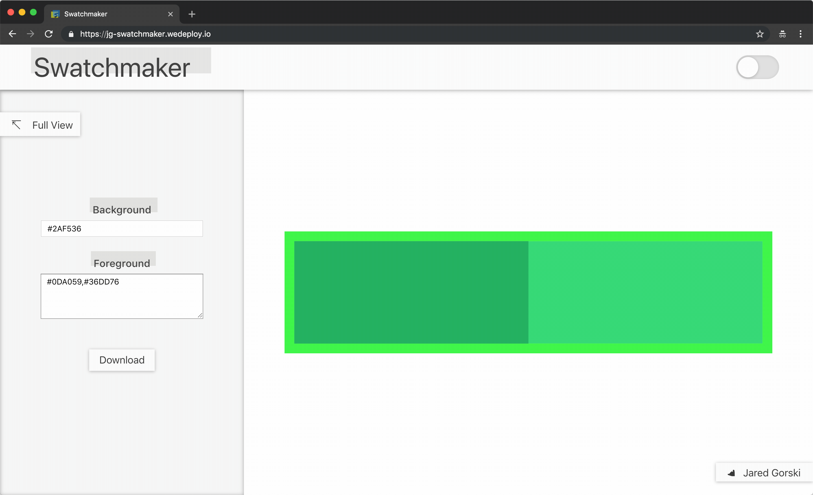

# Swatchmaker
Simple web app for generating and downloading high-quality, custom color swatches

link: https://jg-swatchmaker.wedeploy.io/

### Develop:

`npm i`

`npm run build`

`npm start`

### Deploy on WeDeploy:
Prerequisite: [WeDeploy CLI](https://wedeploy.com/docs/intro/using-the-command-line/)

`npm run build`

`cd build`

`we deploy -p swatchmaker`

### Explanation
The point here is simple: generate and download a high-quality PNG swatch with one background color and all the foreground colors. Swatches may be useful for [README](https://github.com/jaredgorski/Nineties/blob/master/README.md)s, documentation, or maybe even coordinating colors for your next interior design project 🎨

Feel free to open issues, send pull-requests, or [ping the creator](mailto:jaredgorski6@gmail.com) with insults, kudos, or questions!
